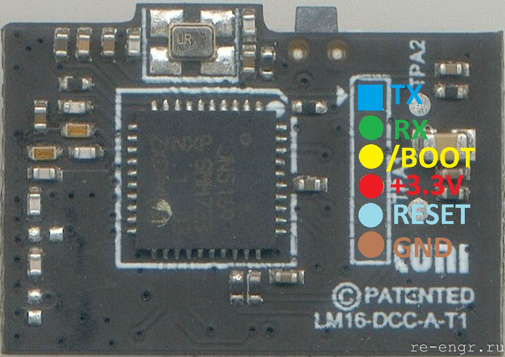
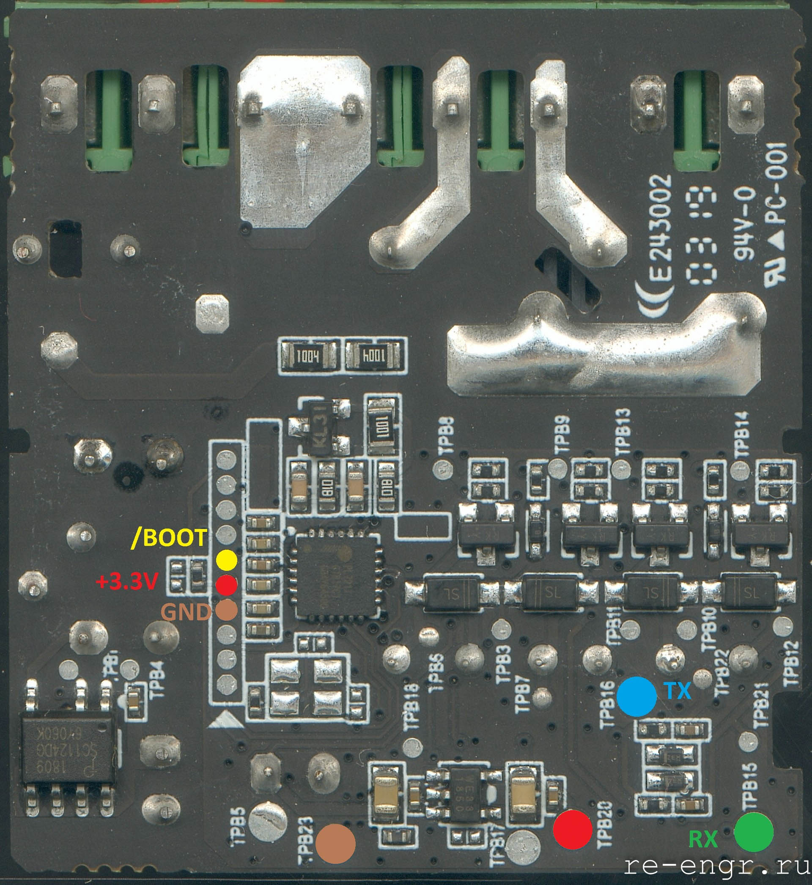

Прошивки для оригинального устройства Aqara relay LLKZMK11LM. Так же эти прошивки подходят для реле [ZR2A](https://re-engr.ru/zr2a/).  
Полного списка изменений у меня нет, только несколько заметок:
* lumi_relay_c2acn01_0035_09202018.bin - это самая ранняя прошивка известная мне. Основная проблема - в MiHome для реле с этой прошивкой нет функции Interlock;
* lumi_relay_c2acn01_0042_04202020.bin - в MiHome можно включить режим Interlock для устройств с этой версией прошивки. Возможно это добавили раньше;
* lumi_relay_c2acn01_0046.bin - в Aqara Home по этой версии было написано так: "исправлена проблема с неработоспособностью реле после отключения питания";

Прошивки предназначены для записи через FlashProgrammer, не через OTA!

