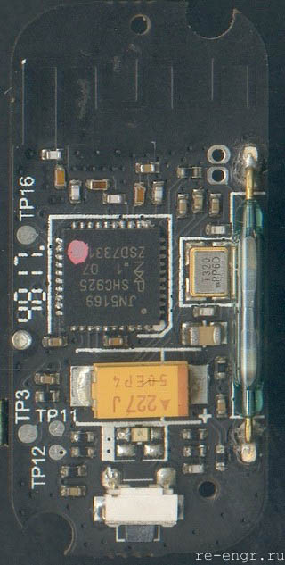
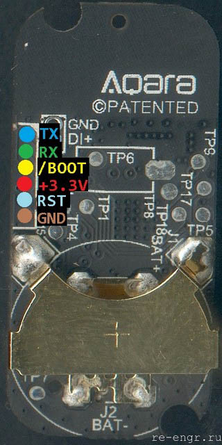

Здесь собраны прошивки позволяющие улучшить работу датчика Aqara Window Door Sensor (MCCGQ11LM)
Дополнительная информация  https://re-engr.ru/aqara_magnet_custom_fw/

В каталоге `fw_original` хранятся оригинальные версии прошивок.  
В каталоге `fw_custom` хранятся модифицированные версии прошивок. 

## История изменений 
* fw_original/`lumi_sensor_magnet_v0010.bin`;  
 Производитель: MI  
 Версия ПО: 0.0.0_0010  
 Модель: MCCGQ01LM  
 Build date: Apr 24 2015 16:46:38   

* fw_custom/v101/`fw_mccgq11lm_101.bin`;
  - Добавлен EP2;
  - Для EP2 добавлен клиентский кластер OnOff (EP2);
  - Функция Binding для клиенсткого кластера OnOff (EP2);
  - Для клиенсткого кластера OnOff (EP2) доступна одна команда: Toggle;
  - Кластер OnOff (EP2) имеет тот же входной сигнал что и OnOff (EP1) и нужен для выбора команды Toggle при использовании функции Binding;
 
* fw_custom/v100/`fw_mccgq11lm_100.bin`;
  - Для EP1 добавлен клиентский кластер OnOff (0x06);
  - Функция Binding для клиенсткого кластера OnOff;
  - Для клиенсткого кластера OnOff (EP1) доступны две команды: On, Off;
  - Размер таблицы для Binding - 20 записей;

 

## Распиновка

