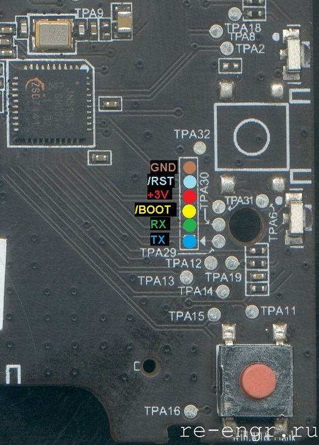

# Wall Switch
В каталоге `fw_original` хранятся оригинальные версии прошивок.   
В каталоге `fw_custom` хранятся пользовательские версии (**там пока пусто**)
## Version
 * fw_original/`lumi_ctrl_neutral2_0018.bin` 
 
 Производитель: Aqara  
 Версия ПО: 0.0.0_0018  
 Версия без нуля. 2 клавиши.   

## Pinouts

