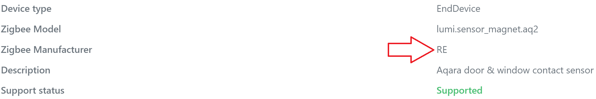

# Door & window sensor

В каталоге `fw_original` хранятся оригинальные версии прошивок.   
В каталоге `fw_custom` хранятся пользовательские версии прошивок.

## Version
 * fw_original/`perenio_pecws01_20180305` 
 ```
 Zigbee Manufacturer: LDS  
 Model Identifier: ZHA-DoorLockSensor
 Application version: 25
 SW Build ID: 2.4
 Build date: 20180305-27
 Man ID: 0x1168
 ```
 * fw_custom/`fw_perenio_pecws01_mccgq11lm_101.bin`  
 ```
 Zigbee Manufacturer: RE 
 Model Identifier: lumi.sensor_magnet.aq2
 Application version: 101
 SW Build ID: 3000-0001
 Build date: 20230210
 Man ID: 0xF037
 ```
 В z2m устройство определяется как Xiaomi MCCGQ11LM. Отличается от оригинального сенсора Xiaomi с [пользовательской прошивкой](https://github.com/re-engr/zigbee_firmware/tree/main/aqara/sensor_magnet) аттрибутом Zigbee Manufacturer (RE).  
 
 
 
 Данная прошивка полностью повторяет функционал [прошивки для сенсора Aqara](https://github.com/re-engr/zigbee_firmware/tree/main/aqara/sensor_magnet). Номер версии совпадает. Отличия в назначении выводов микроконтроллера. 

## Pinouts

